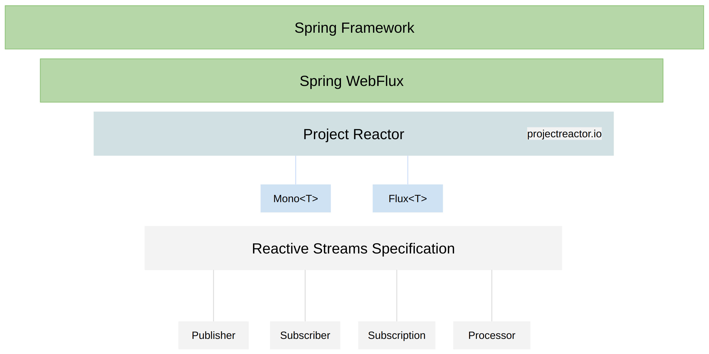

# Reactive Non-Blocking Applications with Spring WebFlux

## Table of Contents

- [Reactive Non-Blocking Applications with Spring WebFlux](#reactive-non-blocking-applications-with-spring-webflux)
  - [Table of Contents](#table-of-contents)
  - [Introduction](#introduction)
  - [What is Spring WebFlux?](#what-is-spring-webflux)
    - [Key Components](#key-components)
  - [Project Reactor and Reactive Data Types](#project-reactor-and-reactive-data-types)
  - [Reactive Streams Specification](#reactive-streams-specification)
    - [Relationship Between Components](#relationship-between-components)
  - [Summary](#summary)
  - [Next Steps](#next-steps)
- [Introduction to Reactive Programming](#introduction-to-reactive-programming)
  - [Overview](#overview)
  - [Key Concepts](#key-concepts)
    - [1. **Non-Blocking vs. Asynchronous Operations**](#1-non-blocking-vs-asynchronous-operations)
    - [2. **Core Principles of Reactive Programming**](#2-core-principles-of-reactive-programming)
      - [**Data Streams**](#data-streams)
      - [**Propagation of Change**](#propagation-of-change)
    - [3. **Advantages of Reactive Programming**](#3-advantages-of-reactive-programming)
  - [Functional Programming in Reactive Applications](#functional-programming-in-reactive-applications)
    - [**Imperative vs. Functional Programming**](#imperative-vs-functional-programming)
      - [**Imperative Approach (Traditional Spring MVC Example)**](#imperative-approach-traditional-spring-mvc-example)
      - [**Functional Approach (Reactive Programming Example)**](#functional-approach-reactive-programming-example)
    - [**Example: Converting to Functional Programming**](#example-converting-to-functional-programming)
  - [Conclusion](#conclusion)


## Introduction
This course covers how to create reactive, non-blocking applications using the **Spring Framework** and its **Spring WebFlux** module. 



## What is Spring WebFlux?
Spring Framework supports both **traditional non-reactive** and **reactive** applications. To enable reactive programming, Spring provides **Spring WebFlux**, a module designed for building **reactive applications**.

### Key Components
- **Spring WebFlux** is **not** a separate framework but a module within Spring Framework.
- It leverages **Project Reactor**, a powerful library for handling data asynchronously and in a **non-blocking** manner.
- Project Reactor allows handling multiple HTTP requests concurrently without waiting for tasks to complete sequentially.

## Project Reactor and Reactive Data Types
Spring WebFlux relies on **Project Reactor**, which introduces two key reactive data types:

- **Mono** → Returns at most **one** item.
- **Flux** → Returns **multiple** items.

These types make it easier to handle data reactively in Spring applications.

## Reactive Streams Specification
Reactive programming in Spring follows the **Reactive Streams Specification**, a standard for **non-blocking data processing**. It defines four core interfaces:

1. **Publisher** → Emits data asynchronously.
2. **Subscriber** → Consumes and processes data emitted by the Publisher.
3. **Subscription** → Manages the connection between Publisher and Subscriber.
4. **Processor** → Acts as both a Publisher and a Subscriber, allowing transformation of data.

### Relationship Between Components
- If a **Publisher** emits at most one item → use **Mono**.
- If a **Publisher** emits multiple items → use **Flux**.

## Summary
- **Reactive Streams Specification** defines a standard for non-blocking data handling.
- **Project Reactor** provides implementations for these standards.
- **Mono and Flux** are the key reactive types used in Spring WebFlux.
- **Spring WebFlux** enables the creation of fully reactive web applications using Spring Framework.

## Next Steps
In the following lessons, we will explore these concepts in more detail and build a **fully functional reactive application** using **Spring WebFlux**.

---


# Introduction to Reactive Programming

## Overview
Reactive programming enables the development of non-blocking applications that can efficiently handle both asynchronous and synchronous operations. It is particularly useful for applications that need to support a large number of concurrent users.

## Key Concepts

### 1. **Non-Blocking vs. Asynchronous Operations**
- Reactive applications are non-blocking but do not necessarily need to be asynchronous.
- Synchronous operations can still be part of a reactive system, particularly when working with in-memory data or business logic that does not involve I/O operations.

### 2. **Core Principles of Reactive Programming**
#### **Data Streams**
- A data stream is a sequence of data elements made available over time.
- Similar to a continuous flow of data, like water in a river.
- Reactive programming processes each element as it arrives instead of waiting for the entire dataset.

#### **Propagation of Change**
- When data changes, the change automatically propagates through the system.
- Similar to spreadsheet formulas, where updating one cell updates all dependent cells.

### 3. **Advantages of Reactive Programming**
- Efficiently handles large-scale concurrent operations.
- Uses functional programming concepts for cleaner, more maintainable code.
- Minimizes the need for explicit flow control structures like `if-else` and `try-catch`.

## Functional Programming in Reactive Applications
Reactive programming leverages a functional programming style rather than an imperative approach. This involves:
- Using **reactive streams** to handle data flow.
- Implementing **Lambda functions** for concise, readable code.
- Utilizing **operators** like `map` and `filter` for data processing.

### **Imperative vs. Functional Programming**
#### **Imperative Approach (Traditional Spring MVC Example)**
- Explicitly stores values in variables.
- Uses `if-else` conditions to control program flow.
- Handles errors with `try-catch` blocks.

#### **Functional Approach (Reactive Programming Example)**
- Uses **function composition** instead of step-by-step instructions.
- Chains together operators in a **pipeline** to process data.
- Replaces `if-else` with **operators** like `switchIfEmpty`.

### **Example: Converting to Functional Programming**
```typescript
getUserById(id: string) {
  return userRepository.findById(id)
    .map(user -> transform(user))
    .switchIfEmpty(Mono.just(defaultUser));
}
```
- No explicit variables.
- No `if-else` or `try-catch` blocks.
- Uses `map` to transform data and `switchIfEmpty` to handle missing results.

## Conclusion
Reactive programming allows developers to build efficient, scalable applications using functional programming techniques. By leveraging reactive streams and operators, developers can create **non-blocking** and **highly concurrent** systems with cleaner and more maintainable code.

In upcoming lessons, you will explore various **reactive operators** and learn how to apply them effectively in real-world applications.


