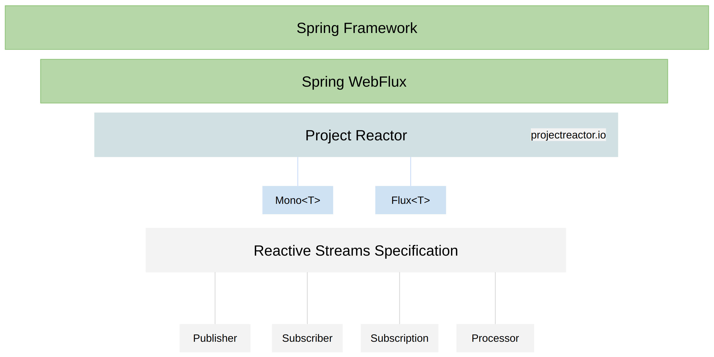
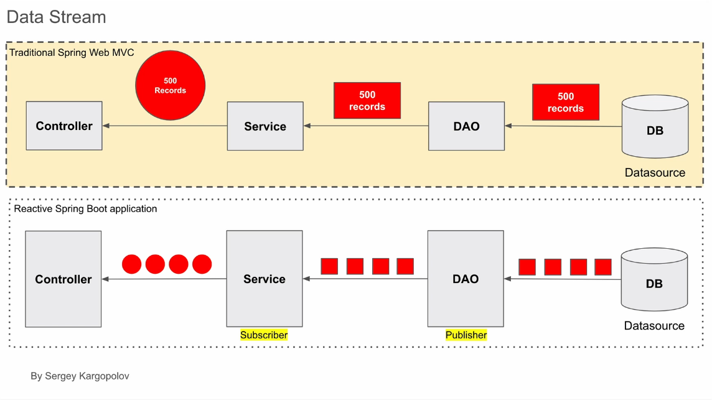
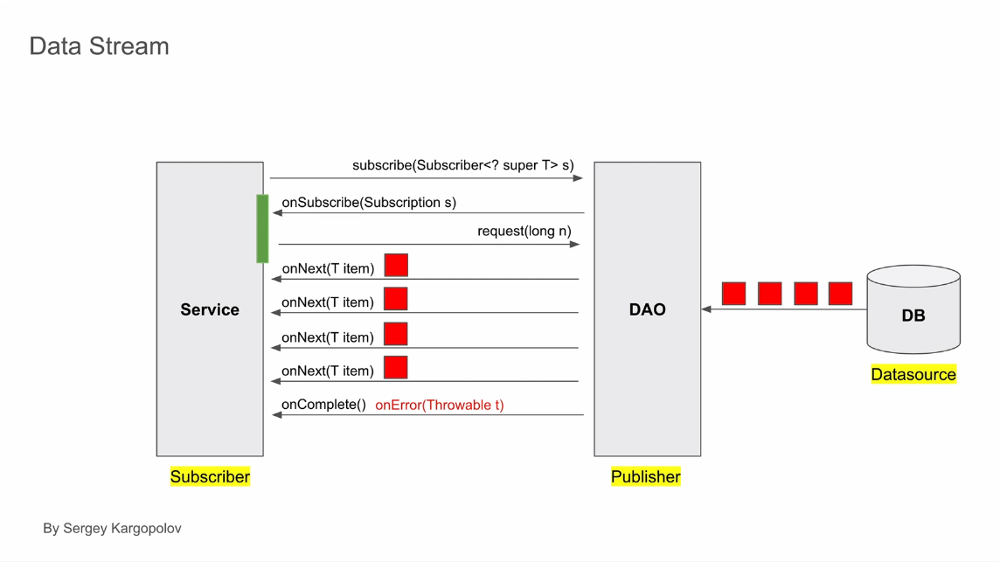
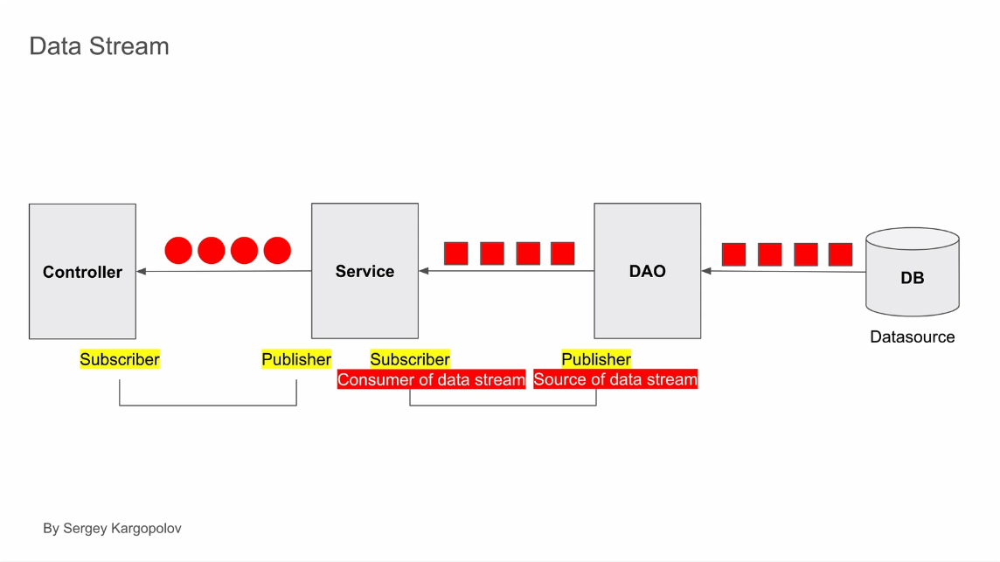

# Reactive Non-Blocking Applications with Spring WebFlux

## Table of Contents

- [Reactive Non-Blocking Applications with Spring WebFlux](#reactive-non-blocking-applications-with-spring-webflux)
  - [Table of Contents](#table-of-contents)
  - [Introduction](#introduction)
  - [What is Spring WebFlux?](#what-is-spring-webflux)
    - [Key Components](#key-components)
  - [Project Reactor and Reactive Data Types](#project-reactor-and-reactive-data-types)
  - [Reactive Streams Specification](#reactive-streams-specification)
    - [Relationship Between Components](#relationship-between-components)
  - [Summary](#summary)
  - [Next Steps](#next-steps)
- [Introduction to Reactive Programming](#introduction-to-reactive-programming)
  - [Overview](#overview)
  - [Key Concepts](#key-concepts)
    - [1. **Non-Blocking vs. Asynchronous Operations**](#1-non-blocking-vs-asynchronous-operations)
    - [2. **Core Principles of Reactive Programming**](#2-core-principles-of-reactive-programming)
      - [**Data Streams**](#data-streams)
      - [**Propagation of Change**](#propagation-of-change)
    - [3. **Advantages of Reactive Programming**](#3-advantages-of-reactive-programming)
  - [Functional Programming in Reactive Applications](#functional-programming-in-reactive-applications)
    - [**Imperative vs. Functional Programming**](#imperative-vs-functional-programming)
      - [**Imperative Approach (Traditional Spring MVC Example)**](#imperative-approach-traditional-spring-mvc-example)
      - [**Functional Approach (Reactive Programming Example)**](#functional-approach-reactive-programming-example)
    - [**Example: Converting to Functional Programming**](#example-converting-to-functional-programming)
  - [Conclusion](#conclusion)
- [Reactive Data Streams in Spring Applications](#reactive-data-streams-in-spring-applications)
  - [Key Concepts](#key-concepts-1)
    - [1. Data Streaming in Reactive Applications](#1-data-streaming-in-reactive-applications)
    - [2. Publisher and Subscriber](#2-publisher-and-subscriber)
    - [3. Controlling Data Flow](#3-controlling-data-flow)
    - [4. Backpressure](#4-backpressure)
  - [Example](#example)
  - [Summary](#summary-1)
  - [To-Do](#to-do)
- [Backpressure and Data Streams in Reactive Programming](#backpressure-and-data-streams-in-reactive-programming)
  - [Key Concepts](#key-concepts-2)
    - [What is Backpressure?](#what-is-backpressure)
    - [How Backpressure Works](#how-backpressure-works)
    - [Default Behavior](#default-behavior)
    - [Importance of Backpressure](#importance-of-backpressure)
  - [Examples](#examples)
    - [Example 1: Using the Request Method](#example-1-using-the-request-method)
    - [Example 2: Default Behavior](#example-2-default-behavior)
    - [Example 3: Handling Slow Subscribers](#example-3-handling-slow-subscribers)
  - [Summary](#summary-2)
    - [Key Takeaways](#key-takeaways)


## Introduction
This course covers how to create reactive, non-blocking applications using the **Spring Framework** and its **Spring WebFlux** module. 



## What is Spring WebFlux?
Spring Framework supports both **traditional non-reactive** and **reactive** applications. To enable reactive programming, Spring provides **Spring WebFlux**, a module designed for building **reactive applications**.

### Key Components
- **Spring WebFlux** is **not** a separate framework but a module within Spring Framework.
- It leverages **Project Reactor**, a powerful library for handling data asynchronously and in a **non-blocking** manner.
- Project Reactor allows handling multiple HTTP requests concurrently without waiting for tasks to complete sequentially.

## Project Reactor and Reactive Data Types
Spring WebFlux relies on **Project Reactor**, which introduces two key reactive data types:

- **Mono** → Returns at most **one** item.
- **Flux** → Returns **multiple** items.

These types make it easier to handle data reactively in Spring applications.

## Reactive Streams Specification
Reactive programming in Spring follows the **Reactive Streams Specification**, a standard for **non-blocking data processing**. It defines four core interfaces:

1. **Publisher** → Emits data asynchronously.
2. **Subscriber** → Consumes and processes data emitted by the Publisher.
3. **Subscription** → Manages the connection between Publisher and Subscriber.
4. **Processor** → Acts as both a Publisher and a Subscriber, allowing transformation of data.

### Relationship Between Components
- If a **Publisher** emits at most one item → use **Mono**.
- If a **Publisher** emits multiple items → use **Flux**.

## Summary
- **Reactive Streams Specification** defines a standard for non-blocking data handling.
- **Project Reactor** provides implementations for these standards.
- **Mono and Flux** are the key reactive types used in Spring WebFlux.
- **Spring WebFlux** enables the creation of fully reactive web applications using Spring Framework.

## Next Steps
In the following lessons, we will explore these concepts in more detail and build a **fully functional reactive application** using **Spring WebFlux**.

---


# Introduction to Reactive Programming

## Overview
Reactive programming enables the development of non-blocking applications that can efficiently handle both asynchronous and synchronous operations. It is particularly useful for applications that need to support a large number of concurrent users.

## Key Concepts

### 1. **Non-Blocking vs. Asynchronous Operations**
- Reactive applications are non-blocking but do not necessarily need to be asynchronous.
- Synchronous operations can still be part of a reactive system, particularly when working with in-memory data or business logic that does not involve I/O operations.

### 2. **Core Principles of Reactive Programming**
#### **Data Streams**
- A data stream is a sequence of data elements made available over time.
- Similar to a continuous flow of data, like water in a river.
- Reactive programming processes each element as it arrives instead of waiting for the entire dataset.

#### **Propagation of Change**
- When data changes, the change automatically propagates through the system.
- Similar to spreadsheet formulas, where updating one cell updates all dependent cells.

### 3. **Advantages of Reactive Programming**
- Efficiently handles large-scale concurrent operations.
- Uses functional programming concepts for cleaner, more maintainable code.
- Minimizes the need for explicit flow control structures like `if-else` and `try-catch`.

## Functional Programming in Reactive Applications
Reactive programming leverages a functional programming style rather than an imperative approach. This involves:
- Using **reactive streams** to handle data flow.
- Implementing **Lambda functions** for concise, readable code.
- Utilizing **operators** like `map` and `filter` for data processing.

### **Imperative vs. Functional Programming**
#### **Imperative Approach (Traditional Spring MVC Example)**
- Explicitly stores values in variables.
- Uses `if-else` conditions to control program flow.
- Handles errors with `try-catch` blocks.

#### **Functional Approach (Reactive Programming Example)**
- Uses **function composition** instead of step-by-step instructions.
- Chains together operators in a **pipeline** to process data.
- Replaces `if-else` with **operators** like `switchIfEmpty`.

### **Example: Converting to Functional Programming**
```typescript
getUserById(id: string) {
  return userRepository.findById(id)
    .map(user -> transform(user))
    .switchIfEmpty(Mono.just(defaultUser));
}
```
- No explicit variables.
- No `if-else` or `try-catch` blocks.
- Uses `map` to transform data and `switchIfEmpty` to handle missing results.

## Conclusion
Reactive programming allows developers to build efficient, scalable applications using functional programming techniques. By leveraging reactive streams and operators, developers can create **non-blocking** and **highly concurrent** systems with cleaner and more maintainable code.

In upcoming lessons, you will explore various **reactive operators** and learn how to apply them effectively in real-world applications.

---

# Reactive Data Streams in Spring Applications

This lesson explores the flow of data in reactive programming, emphasizing how data streams are processed between components in a reactive Spring application. Below are key concepts, examples, and takeaways to help understand reactive data streams and their implementation using the Reactive Streams specification.



## Key Concepts

### 1. Data Streaming in Reactive Applications
Reactive applications process items as they arrive rather than waiting for all items to be ready. For example:

- A database retrieves 500 records.
- Instead of sending all records as one large collection, they are streamed one by one to the subscriber.
- The subscriber processes each item as it arrives, creating a continuous and asynchronous flow.

Benefits:
- **Memory Efficiency:** No need to hold all records in memory.
- **Non-blocking:** The application can handle other tasks while processing items.
- **Streaming:** Results can be sent to the client even before all records are retrieved.

### 2. Publisher and Subscriber
These terms come from the Reactive Streams specification:
- **Publisher:** Emits a sequence of items.
- **Subscriber:** Consumes items from the publisher according to its demand.

Flow of data:
- The subscriber calls the `subscribe()` method on the publisher to initiate the subscription process.
- The publisher sends a `subscription` object to the subscriber.
- The subscriber uses this object to request items and control the rate of data flow.
- The publisher calls the `onNext()` method to deliver each item one by one.
- Once all items are sent, the publisher calls `onComplete()`. If an error occurs, `onError()` is called instead.



### 3. Controlling Data Flow
Subscribers can control the flow of data by specifying how many items to request at a time using the `request()` method. This mechanism helps manage data processing rates and prevents overload.

### 4. Backpressure
If the publisher produces data faster than the subscriber can consume it, backpressure comes into play to manage the flow of data efficiently.

## Example
A simple example of data streaming between components:

1. **Data Access Object (DAO):** Acts as a publisher and retrieves records from the database.
2. **Service Layer:** Acts as a subscriber to the DAO and a publisher to the controller.
3. **Controller:** Acts as the final subscriber that sends processed data to the client.

Example code snippet:
```java
repository.findAllUsers()  // Publisher
          .filter(user -> user.isActive())
          .map(user -> transformUser(user))
          .doOnError(error -> log.error("Error fetching users", error))
          .subscribe(user -> sendToClient(user));  // Subscriber
```



## Summary
In reactive programming:
- Data is streamed between components as items arrive.
- Publishers emit items one at a time, and subscribers process them immediately.
- The subscription object allows for controlling data flow and handling errors.
- Backpressure helps manage cases where data production exceeds consumption capacity.

This reactive flow ensures efficient, non-blocking, and scalable data handling in Spring applications. Subsequent lessons will include practical examples with logging enabled to visualize the streaming process.

## To-Do
- **Next Lesson:** Explore the concept of Backpressure in more detail.
- **Hands-on Example:** Build a REST API with Spring Framework to demonstrate reactive data streams in action.

--- 

# Backpressure and Data Streams in Reactive Programming

This lesson focuses on understanding backpressure in reactive programming and how subscribers can manage data streams effectively.

## Key Concepts

### What is Backpressure?
Backpressure is a mechanism that allows subscribers to control how much data they receive from publishers. This prevents subscribers from being overwhelmed by a fast publisher, ensuring smooth operation even under heavy data loads.

### How Backpressure Works
- The **request method** is used to specify the number of items the subscriber is ready to process.
- When invoked, the request method tells the publisher how many items to send.
- The publisher then sends only the number of items specified.

### Default Behavior
- By default, the request method requests all items at once, which can be problematic if the subscriber is slow.
- Unprocessed items are held in memory, potentially slowing down the application if there is insufficient memory.

### Importance of Backpressure
- Critical in scenarios where publishers emit large numbers of items.
- Helps avoid memory overload and performance degradation.

## Examples

### Example 1: Using the Request Method
```java
// Example of controlling data flow
subscription.request(10); // Request 10 items from the publisher
```
This tells the publisher to send exactly 10 items to the subscriber.

### Example 2: Default Behavior
```java
// Default request behavior
subscription.request(Long.MAX_VALUE); // Requests all items at once
```
This default behavior can lead to issues if the subscriber cannot process all items quickly.

### Example 3: Handling Slow Subscribers
```java
// Managing slow subscriber
subscription.request(5); // Subscriber processes 5 items at a time
```
This approach prevents the subscriber from being overwhelmed.

## Summary
Backpressure is essential for managing data streams in reactive programming. It enables subscribers to control the flow of data, ensuring efficient processing without overwhelming the system. In the next lessons, more advanced topics related to backpressure will be explored.

### Key Takeaways
- Use the request method to manage data flow effectively.
- Default behavior may lead to memory issues if subscribers are slow.
- Managing backpressure ensures smoother and more efficient application performance.

